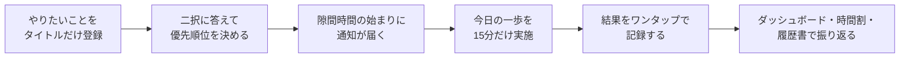

# 人生のコンパス（Life Compass）

> **迷う時間を、進む時間へ。**

やりたいことを**タイトルだけ**登録し、**二択**で答えるだけで優先順位を学習する。週間の時間割から求めた**隙間時間**が始まると、いま踏み出すべき**今日の一歩**をひとつだけ通知する。Web・iPhone・Apple Watch から、15分の一歩をその場で始めて記録できる。

## コンセプト

「人生のコンパス」は、ToDo管理アプリではない。やるべきことを管理するのではなく、**"今日、最初の一歩を決める"** ことを支援する意思決定アプリである。

従来のToDoアプリは「何が残っているか」を管理する。そのため、タイトル・カテゴリ・優先度・期限・タグ・メモ・繰り返し・通知と入力が増え、やりたいことが多い人ほど、何から始めるかを決められずに手が止まる。

人生のコンパスは、**入力を極限まで減らし、選ぶだけで「今の自分にとって最も価値のある行動」が届く**ようにすることで、この迷いをなくす。

| 考え方 | 内容 |
|---|---|
| 入力より、選ぶ | 登録はタイトルだけ。優先順位は「どちらが今重要？」の二択に答えるだけで決まる |
| 表示するのは、一つだけ | 画面にも通知にも出すのは「今日の一歩」ひとつ。ランキングや一覧は振り返るときに見る |
| 夢は大きく、一歩は小さく | 大きなやりたいことはツリーで分解し、15〜30分で終わる葉を「今日の一歩」にする。コンパスが指すのは目的地ではなく次の一歩 |
| 急かさない | 通知は、時間割の隙間時間が始まるときに1回だけ。短すぎる隙間や深夜には鳴らさない |
| 100点主義にしない | 予定より短くても「少しだけ」として記録する。できなかった日も責めない |

| 項目 | 内容 |
|---|---|
| ステータス | **Phase 3 実装済み（実機確認待ち）**（[ロードマップ](#15-開発ロードマップ)の Phase 0〜2.6 完了。Phase 3 は AI 側の実装が完了し、iPhone・Apple Watch の実機確認と履歴書の写真が残る） |
| リリース日 | 未定 |
| 作成者 | **Makoto Kamimura** — [@makoto-kamimura](https://github.com/makoto-kamimura) |

このREADMEは、プロジェクト紹介と仕様書を兼ね、次の2部と付録で構成する。

| 部 | 内容 | 主な読者 |
|---|---|---|
| [第1部 概要説明](#第1部-概要説明) | アプリの目的、機能と画面の仕様、ロードマップ | すべての人 |
| [第2部 技術説明](#第2部-技術説明) | 技術スタック、システム構成、クイックスタート、実装方針、データモデル、API、非機能要件 | 開発者 |
| [付録](#付録) | 決定事項、未決事項 | すべての人 |

そのほかの資料（タスク一覧など）は [docs/](docs/README.md) に置く。

## 目次

- [コンセプト](#コンセプト)
- [第1部 概要説明](#第1部-概要説明)
  - [特徴](#特徴) / [使い方のイメージ](#使い方のイメージ)
  - [1. 概要](#1-概要) / [2. 用語](#2-用語) / [3. 基本フロー](#3-基本フロー) / [4. 画面一覧](#4-画面一覧) / [5. 認証とアカウント](#5-認証とアカウント)
  - [6. やりたいこと（タスクツリー）](#6-やりたいことタスクツリー) / [7. 二択とランキング](#7-二択とランキング) / [8. 今日の一歩](#8-今日の一歩) / [9. タイマーと完了記録](#9-タイマーと完了記録)
  - [10. 時間割と隙間時間](#10-時間割と隙間時間) / [11. 通知](#11-通知) / [12. 履歴書](#12-履歴書) / [13. ダッシュボード](#13-ダッシュボード) / [14. Apple Watch](#14-apple-watch)
  - [15. 開発ロードマップ](#15-開発ロードマップ)
- [第2部 技術説明](#第2部-技術説明)
  - [16. 技術スタックとシステム構成](#16-技術スタックとシステム構成)（[クイックスタート](#167-クイックスタート)を含む）
  - [17. 認証の実装](#17-認証の実装) / [18. 機能ごとの実装方針](#18-機能ごとの実装方針) / [19. データモデル](#19-データモデル) / [20. API](#20-api) / [21. 非機能要件](#21-非機能要件)
- [付録](#付録)
  - [22. 決定事項](#22-決定事項) / [23. 未決事項](#23-未決事項)

---

# 第1部 概要説明

アプリの目的・機能・画面の仕様をまとめる。技術的な内容は[第2部](#第2部-技術説明)に分ける。

## 特徴

| 特徴 | 内容 |
|---|---|
| タイトルだけの登録 | やりたいことはタイトルだけで登録できる。所要時間・期限は任意 |
| 二択で優先順位 | 「どちらが今重要？」に1〜2秒で答えるだけで、Elo レーティングでランキングが作られる |
| タスクツリー | やりたいことを子タスクに分解し、15分でできる葉まで細かくする。二択とランキングは最上位（ルート）だけで行う |
| 今日の一歩 | 優先順位・最近やっていない期間・締切からルートを1つ選び、そのツリーの葉を「今日の一歩」として1つだけ出す。実施できる一歩が無いときは、二択や細分化そのものを一歩として案内する |
| 時間割と隙間時間 | 1週間の予定を曜日ごとに登録すると、24時間の円グラフの塗り残しが「隙間時間」になる |
| 隙間時間の通知 | 隙間時間が始まる瞬間に、今日の一歩をプッシュ通知で届ける。[開始] からタイマーを直接開ける |
| タイマーと完了記録 | 15分のタイマーで実施し、結果は「完了 / 少しだけ / また今度」のワンタップで記録する |
| 履歴書 | 今の履歴書と、なりたい将来の履歴書を書ける。将来の目標はそのまま「やりたいこと」になり、必要なタスクに分解できる。JIS 様式に近い PDF で出力できる |
| ダッシュボード | 今日のおすすめ・今週完了数・比較回数・継続日数・ランキングを最小限で表示する |
| Web / iPhone / Apple Watch | 3つの端末で同じ振る舞い・同じ文言にそろえる。Apple Watch では今日の一歩の実施だけを行う |

## 使い方のイメージ



毎日たった一つの提案と、たった15分の行動。その積み重ねで、人生を少しずつ望む方向へ進める。

## 1. 概要

### 1.1 ポジショニング

「やることを増やすアプリ」ではなく、**迷いを減らし、最初の一歩を踏み出すためのアプリ**と位置付ける。

| | 従来のToDoアプリ | 人生のコンパス |
|---|---|---|
| 管理するもの | 何が残っているか | 今の自分にとって最も価値のある行動 |
| 入力 | タイトル・カテゴリ・優先度・期限・タグ・メモ・繰り返し・通知 | タイトルだけ（所要時間・期限は必要になったら） |
| 優先順位 | 自分で設定する | 二択の回答から学習する |
| 表示 | 一覧 | 今日の一歩ひとつ |
| 通知 | 期限や設定した時刻 | 隙間時間の始まり |

### 1.2 原則

**入力より、選ぶ。** ユーザーに求める入力は極限まで少なくする。すべての機能は、次の流れを崩さないように設計する。

```text
タイトルだけ登録 → 二択で選ぶ → 今日のおすすめが届く
```

### 1.3 ターゲット

- やりたいことが多い人
- 優先順位が決められない人
- ToDoアプリが続かなかった人
- 自己成長したい人
- ライフワークバランスを大切にしたい人

### 1.4 提供する価値

人生のコンパスは、あなたの価値観を学び、今日の一歩を示すパートナーである。

キャッチコピーの候補：

- 迷う時間を、進む時間へ。（採用）
- 今日の一歩が、未来を変える。
- 人生に、コンパスを。
- 選ぶだけで、進むべき道が見えてくる。
- 今日のあなたに、ちょうどいい一歩を。
- 夢は大きく、一歩は小さく。
- 人生のコンパスは、あなたの夢を「今日できること」に変える。

## 2. 用語

| 用語 | 意味 |
|---|---|
| やりたいこと | ユーザーが登録するタスク。タイトルだけで登録できる |
| ルート（ルートタスク） | タスクツリーの最上位のやりたいこと。二択・ランキング・おすすめの対象になる |
| 子タスク（サブタスク） | やりたいことを分解したタスク。ルートの下に最大5階層まで作れる |
| 葉 | 子を持たないタスク。今日の一歩として提案されるのは葉だけ |
| 今日の一歩 | いま実施する1件。実施するタスク・二択で選ぶ・細分化のいずれか（[第8章](#8-今日の一歩)） |
| 二択 | 2つのルートを並べて「どちらが今重要？」を選ぶこと。結果は Elo レーティングに反映される |
| ランキング | ルートを Elo レーティングの高い順に並べたもの |
| 分解待ち | 「15分でできない」と答えたタスク。今日の一歩の候補から外れ、細分化の対象になる |
| 細分化 | 分解待ちのタスクを、15〜30分で終わる子タスクに分けること |
| 時間割 | 曜日ごとに登録する1週間の予定（週間タイムテーブル） |
| 隙間時間 | 時間割の塗り残しのうち、通知してよい時間帯に入り、最小の長さ以上あるもの |
| スキマ | 時間割の予定に付ける印。その予定の開始時刻にも今日の一歩を通知する |
| 実施記録 | タイマーで実施した結果（完了 / 少しだけ / また今度）と経過時間 |

## 3. 基本フロー

画面の構成（ナビゲーションの並び・「今日の一歩」の中身）は、この流れに合わせている。

### 3.1 やりたいことを登録する

1. Web またはスマートフォンで、やりたいことをタイトルだけで登録する。
2. 必要なら子タスクを追加して、今日できる大きさまで分解する（[第6章](#6-やりたいことタスクツリー)）。
3. 時間割に1週間の予定を登録すると、隙間時間が決まる（[第10章](#10-時間割と隙間時間)）。

### 3.2 隙間時間に今日の一歩を実施する

1. 隙間時間が始まると、スマートフォン（と Apple Watch）に「今日の一歩」の通知が届く（[第11章](#11-通知)）。
2. 通知の [開始] か、アプリの「今日の一歩」からタイマーを始める。
3. 終わったら、結果をワンタップで記録する（[第9章](#9-タイマーと完了記録)）。

### 3.3 実施のループ

隙間時間 15分を使い切るまで、今日の一歩が次々と切り替わる。

| 状況 | 今日の一歩 |
|---|---|
| 実施できるやりたいことがある | そのタスク（開始する → 完了） |
| 15分でできない | 別のやりたいこと（押したタスクは分解待ちになり、候補から外れる） |
| 実施できるやりたいことが無くなった | **二択で選ぶ**（優先度を決めること自体を一歩にする） |
| 優先度付けが確定した | **やりたいことの細分化**（分解すること自体を一歩にする） |
| 実施後もまだ 15分以内 | 改めてやりたいことから今日の一歩を選び直す |

### 3.4 振り返る

ダッシュボード・時間割・履歴書は、振り返るときに Web またはスマートフォンから確認する。

## 4. 画面一覧

3つの端末で同じ機能は**同じ振る舞い・同じ文言**にする。端末ごとの違いは「画面の大きさや入力手段の都合でやむを得ないもの」だけに限り、下表に明記する。

### 4.1 画面と機能

| 画面・機能 | Web | iOS | watchOS |
|---|---|---|---|
| ログイン / 新規登録 | ○ | ○ | iPhone のログインを引き継ぐ |
| ログアウト | 上部メニュー右端 | 各タブのヘッダー右 | iPhone のログアウトに追従 |
| 今日の一歩（パンくず・所要時間・開始する・15分でできない） | ○ | ○ | ○ |
| 今日の一歩＝二択で選ぶ / 細分化（今日の一歩の中に出す） | ○ | ○ | —（iPhone で選ぶよう案内） |
| 隙間時間の残り（15分）と「もう一歩つづける / 今日はここまで」 | ○ | ○ | — |
| タイマー（残り時間・終了する） | ○ | ○ | ○ |
| 結果入力（完了 / 少しだけ / また今度）→ 記録後は今日の一歩へ戻る | ○ | ○ | ○ |
| やりたいこと（ツリー・子タスク追加・削除） | ○ | ○ | — |
| 二択で選ぶ（あとで決める。単独で開いたとき） | ○（←/→ キーでも選べる。`/compare`） | ○ | — |
| やりたいことの細分化（分解待ちの一覧・分解・分解完了。単独で開いたとき） | ○（`/todo`） | ○ | — |
| 時間割「週間タイムテーブル」タブ（曜日タブ・円グラフ・合計・一覧・コピー・スキマ ON/OFF・よく使う項目） | ○ | ○ | — |
| 時間割「スキマ時間設定」タブ（曜日タブ・選んだ曜日の隙間時間・リマインドの設定） | ○（`?tab=slots` で直接開ける） | ○ | — |
| 履歴書「今の履歴書」タブ（プロフィール・学歴・職歴・免許資格の登録と表示） | ○（`/resume`） | ○ | — |
| 履歴書「将来の履歴書」タブ（目標の登録・目標ごとの必要なタスク・達成・なりたい履歴書の見本） | ○（`?tab=future`） | ○ | — |
| 履歴書の PDF 出力（JIS 様式に近い A4・2 ページ。将来の履歴書は目標の行を網掛け） | ○（印刷画面から「PDF に保存」） | ○（PDF を作って共有シート） | — |
| 履歴書の見本（PDF と同じ体裁。保存前の入力と入力中の行を破線でその場に反映） | ○（左に固定） | ○（「見本を見る」でモーダル） | — |
| ダッシュボード（今日のおすすめ・今週完了数・比較回数・継続日数・ランキング） | ○ | ○ | — |
| 通知の [開始] でタイマーを開く | — | ○ | ○ |
| コンプリケーション | — | — | ○ |

### 4.2 ナビゲーション

- ナビゲーションは利用フロー（[第3章](#3-基本フロー)）の2区分にする。Web のサイドメニュー・iOS のタブとも、**進む**「今日の一歩 → やりたいこと」→ **振り返る**「ダッシュボード → 時間割 → 履歴書」の順に並べる。
- 二択で選ぶ・細分化はメニューに出さない。ふだんは今日の一歩の中に出るが、思い立ったときのために URL / 画面は残し、Web は `/compare`・`/todo` で直接開ける（iOS はタブに出さないだけで同じ画面を持つ）。
- ランキングはダッシュボードに統合した（iOS のタブ数を抑えるため。Web の `/ranking` はダッシュボードへ転送する）。
- ログイン済みで `/`・`/login` を開いたら、今日の一歩へ移る。
- Web は、デスクトップ幅では左のサイドバーと2列の配置にし、幅 900px 以下ではサイドバーを上部の横並びに、1024px 以下では2列を1列に畳む。
- watchOS は[第14章](#14-apple-watch)のとおり「今日の一歩」「タイマー」「結果入力」だけを持つ。一覧や編集を伴う画面は置かない。

### 4.3 端末の都合で表現だけ変えているもの

| 項目 | Web | iOS | 理由 |
|---|---|---|---|
| 選択欄 | `<select>` | チップ / モーダルの一覧 | React Native に `<select>` がない |
| 予定タイトルの候補 | 入力欄の下にドロップダウン | 入力欄の下にチップ | 同じ絞り込み（`titleSuggestions`）を端末の部品で出す |
| 円グラフの直接ラベル・吹き出し | あり | なし（一覧で識別） | 小さいリングでは文字が潰れ、タッチにはホバーがない（[18.6節](#186-円グラフの描画)） |
| 9色目以降の区別 | ハッチング | 明度差 | [18.6節](#186-円グラフの描画) |
| 削除の確認 | `window.confirm` | `Alert.alert` | 文言は同じ |
| 履歴書の PDF | ブラウザの印刷画面（送信先「PDF に保存」） | `expo-print` で A4 の PDF を作り共有シート | どちらも同じ HTML（`@shared/resume-document`）から作る |
| 履歴書の見本 | 入力欄の左に固定（時間割の円グラフと同じ置き方） | 「見本を見る」で全画面のモーダル（`react-native-webview`、ピンチで拡大） | 横に並べる幅がない |

## 5. 認証とアカウント

| 項目 | 内容 |
|---|---|
| 登録 | 名前・メールアドレス・パスワード（8文字以上） |
| ログイン | メールアドレスとパスワード |
| Apple Watch | iPhone のログインを引き継ぐ。Watch だけでのログインはない |
| 将来の拡張 | Google・Apple でのログイン（Phase 3.5）。WordPress SSO は対応を予定していない（[D17](#22-決定事項)） |

データは個人ごとに持ち、他のユーザーとは共有しない（家族共有は Phase 5 で別途設計する）。

## 6. やりたいこと（タスクツリー）

「やりたいこと」と「今日できること」は異なる。たとえば「Reactを勉強する」という目標だけでは、何から始めればよいか分からない。そこで、やりたいことを小さな行動に分解するためのタスクツリーを持つ。目的は、**「今日の一歩」が明確になるまで細分化すること**である。

### 6.1 登録

| 項目 | 必須 | 内容 |
|---|---|---|
| タイトル | ○ | 200文字まで。例：Reactを勉強する / 子どもと遊ぶ / コーヒー新メニューを考える / ジムニーでキャンプ / 情報処理安全確保支援士の勉強 |
| 所要時間 | | 15分 / 30分 / 1時間。未設定なら15分として扱う |
| 期限 | | 今日 / 今週 / 今月 / なし（初期値） |

最初はタイトルのみ。所要時間・期限は、必要になったときだけ聞く。

### 6.2 ツリーの構造

```text
人生の目標
└── やりたいこと
    └── プロジェクト
        └── サブタスク
            └── 今日の一歩
```

- ツリーは最大5階層とする。
- 二択・ランキング・おすすめの計算はルート（最上位）だけで行う。サブタスクは比べない。
- アプリが提案するのはルートではなく**葉**である。コンパスが指すのは"目的地"ではなく、"次の一歩"である。

### 6.3 分解の例

```text
Reactを勉強する
└── React Hooks
    ├── useState
    ├── useEffect
    └── useContext
         ├── 公式ドキュメントを読む
         ├── サンプルを書く
         └── 今日の一歩：公式ページを15分読む

ジムニーでキャンプへ行く
└── キャンプ用品を揃える
    ├── テントを決める
    ├── 寝袋を決める
    └── 今日の一歩：寝袋を比較する（15分）

情報処理安全確保支援士
└── 午前問題
    ├── 暗号
    ├── ネットワーク
    ├── 法律
    └── 今日の一歩：暗号問題を5問解く

新メニューを作る
└── レシピ作成
    ├── 豆を選ぶ
    ├── 抽出方法
    ├── 試飲
    └── 今日の一歩：浅煎りで一杯淹れて記録する
```

今日おすすめされるのは、一番下の「今日の一歩」だけである。今日の一歩の画面には、ルートからのパンくず（例：React → useContext → 公式ドキュメントを15分読む）を出す。

### 6.4 今日の一歩の条件

今日の一歩になるタスクは、次の条件を満たす大きさまで分解する。

- 一人でできる
- 15〜30分程度で終わる
- 明確な終了条件がある
- 次の行動が分かる

| よい例 | よくない例 |
|---|---|
| Reactを15分読む | Reactを極める |
| 問題を5問解く | 資格に合格する |
| コーヒーを1杯試作する | キャンプへ行く |

### 6.5 ツリーの編集

- 各タスクの「＋子タスク」から、下の階層に追加する（例：Reactを勉強する → React Hooks → useContext → 公式ドキュメントを15分読む）。
- 親を削除すると、子孫もまとめて削除する。
- 自分自身や子孫を親に指定することはできない。
- 「15分でできない」と答えたタスクは分解待ちになり、「やりたいことの細分化」の一覧に並ぶ。子タスクを足して「分解完了」を押すと、候補に戻る。
- AI によるタスク分解（「Reactを勉強したい」から基礎・Hooks・実践のツリーを作り、15分でできるタスクまで自動で分解する）は将来の機能とする（[Q4](#23-未決事項)）。

### 6.6 上限

- active なルートは1ユーザーあたり100件まで。サブタスクは数えない。

## 7. 二択とランキング

### 7.1 二択の画面

```text
どちらが今重要？
────────────
React勉強
  VS
家族旅行
────────────
◀ 左    ▶ 右
あとで決める
```

- 1〜2秒で答えられるようにする。Web は ←/→ キーでも選べる。
- 「あとで決める」は回答として記録せず、別の組み合わせを出す。
- 比べるのはルートだけ。ルートが2件未満のときは「比較するには「やりたいこと」を2件以上登録してください。」と表示する。
- 比較回数が少なく、レーティングが近い組み合わせを優先して出し、少ない回答数でランキングが収束するようにする（[18.1節](#181-比較ペアの選定)）。

### 7.2 ランキング

比較の履歴から Elo レーティングで優先順位を学習し（[18.2節](#182-elo-レーティング)）、ルートをレーティングの高い順に並べる。ランキングはダッシュボードに表示する（[第13章](#13-ダッシュボード)）。

```text
1 React勉強
2 家族旅行
3 コーヒー新メニュー
4 ジムニーキャンプ
5 資格取得
```

## 8. 今日の一歩

### 8.1 表示

```text
🧭 今日の一歩
React → useContext
公式ドキュメントを15分読む
15分
[開始する]  [15分でできない]
```

表示するのは一つだけ。「15分でできない」を押すと、そのタスクは分解待ちになり、別のやりたいことが表示される。

### 8.2 おすすめの決め方

おすすめは順位だけで決めない。

```text
おすすめスコア = 優先順位 + 最近やっていない補正 + 締切 +（所要時間）
```

- スコアはルート単位で計算し、最高スコアの1件を選ぶ。選ばれたルートのツリーをたどり、分解待ちでない葉を今日の一歩にする（[18.3節](#183-おすすめスコア)・[18.4節](#184-葉の選定)）。
- 所要時間（隙間の長さに収まるものを優遇する補正）は、まだ使っていない（[Q1](#23-未決事項)）。
- 習慣化の補正や、AI による改善は将来の課題とする（[Q6](#23-未決事項)）。

### 8.3 実施できる一歩が無いとき

隙間時間に通知を受けて開いたのに「おすすめはありません」で終わると、そこで手が止まる。そこで、**優先度を決めること・分解すること自体を今日の一歩として案内する**。

| 順 | 今日の一歩 | 条件 | 表示する文言 |
|---|---|---|---|
| 1 | 実施するタスク | 実施できる葉がある | タスクと「開始する」 |
| 2 | 二択で選ぶ | 実施できる葉が無く、優先度付けが確定していない | 今すぐ実施できるやりたいことがありません。どちらを先にやりたいか選ぶことが、今日の一歩です。 |
| 3 | 細分化 | 実施できる葉が無く、優先度付けが確定している | 優先順位が決まりました。上位のやりたいことを15分でできる一歩に分けることが、今日の一歩です。 |
| 4 | なし | やりたいことが無い | やりたいことを登録すると、おすすめが表示されます。 |

- 優先度付けは、active なルートのすべての組み合わせを一度でも比べた時点で確定とみなす。ルートが1件以下なら確定として扱う。
- 細分化の対象は、ルートのレーティングが高いツリーの分解待ちから、浅い（大きな）単位を先に選ぶ。

### 8.4 15分のループ

- 実施・二択・細分化のいずれかが終わると、今日の一歩に戻って次の1件を受け取る。
- 隙間時間の残り（15分）を帯で表示する。残っていれば「まだ時間があります。続けてもう一歩進みましょう。」、使い切ったら「15分たちました。おつかれさま。」と区切りを提案する（「もう一歩つづける / 今日はここまで」）。
- 残り時間は開始時刻との差で求めるので、画面を離れてもずれない。

## 9. タイマーと完了記録

### 9.1 タイマー

「開始する」を押すと、タスクの所要時間（未設定なら15分）のタイマーが始まる。

```text
15:00
React勉強
■■■■□□□□
残り14:59
[終了する]
```

### 9.2 結果の入力

```text
お疲れ様！ できた？
😊 完了
😅 少しだけ
❌ また今度
```

- 入力はワンタップ。記録したら今日の一歩へ戻る。
- 記録するのは、結果（完了 / 少しだけ / また今度）と、実際に経過した時間だけとする。
- 完了・少しだけを記録すると、そのタスクの「最後にやった日時」を更新し、おすすめの補正に使う。
- 送信に失敗したときは「送信に失敗しました。」と表示する。

### 9.3 少しだけ

100点主義にしない。15分の予定で7分だけ実施した場合も、「7分達成」として記録する。

### 9.4 今日できなかった

「今日は無理」のときに「5分だけやりますか？ YES / NO」と提案して行動のハードルを下げる案がある。現在は未実装で、「また今度」として記録する。

## 10. 時間割と隙間時間

時間割は「週間タイムテーブル」と「スキマ時間設定」の2つのタブに分ける。曜日の選択は両タブで共通とする。

### 10.1 週間タイムテーブル

- 1週間の予定を、曜日ごとに「タイトル・開始・終了」で登録する。一度登録すれば毎週そのまま使う（特定の日付だけの予定は扱わない。[Q2](#23-未決事項)）。
- 時刻は15分単位で選ぶ。日をまたぐ予定は、翌曜日のぶんを別に登録する。
- 同じ曜日の中で、予定の時間帯は重ねられない（前の予定の終了と次の予定の開始が同じ時刻なのはよい）。
- 予定を「やりたいこと」に結び付けられる。やりたいことを削除しても、予定は残る。
- 予定を他の曜日へコピーできる。
- よく使うタイトル（仕事・移動・睡眠など）を登録しておき、入力欄の下から選べる。
- 予定に「スキマ」の印を付けると、その開始時刻にも今日の一歩を通知する（[第11章](#11-通知)）。
- 睡眠・運動・スキマの合計時間を表示する。

### 10.2 円グラフ

選んだ曜日の24時間を円（ドーナツ）1周として描き、塗り残しを空き時間として見せる。曜日のタブには各曜日の空き時間の合計を出し、どの曜日に余白があるかを一覧でつかめるようにする。描き方の詳細は[18.6節](#186-円グラフの描画)。

### 10.3 スキマ時間設定

- 選んだ曜日の隙間時間を一覧で表示する。
- 隙間時間は別に登録するものではなく、予定の塗り残しから求める（[18.7節](#187-隙間時間の算出)）。
- リマインドの設定：

| 設定 | 初期値 | 内容 |
|---|---|---|
| 最小の隙間 | 30分 | これより短い隙間では通知しない |
| 通知してよい時間帯 | 7:00〜22:00 | この時間帯の外では、隙間時間として扱わない |

## 11. 通知

**隙間時間が始まる瞬間に声をかける。** 固定時刻の朝一斉通知ではなく、その日（曜日）の予定の切れ目に合わせて「今日の一歩」を提案する。

```text
🧭 今日の一歩
Reactを15分やりませんか？
[開始] [あとで]
```

- 隙間時間の開始時刻ちょうどに1回だけ送る。隙間の途中では鳴らさない。
- 「スキマ」の印を付けた予定の開始時刻にも送る。こちらはユーザーが明示した枠なので、通知してよい時間帯の外でも送る。
- 同じ時刻に送るのは1通だけとする（隙間時間とスキマの予定が重なっても1通）。
- 1日の通知回数は隙間の数に等しい（予定を詰めた日は少なく、空いた日は多くなる）。多すぎるときは、最小の隙間を長くする。
- 通知の内容は今日の一歩の種類で変える。実施できる葉が無くても、二択・細分化を提案するので黙らない。やりたいことが1件も無いときだけ送らない。
- iPhone で受けた通知は、未読なら Apple Watch に転送される。[開始] を押すと、iPhone でも Watch でもタイマー画面を直接開く。

## 12. 履歴書

就職・転職用の履歴書を、「今の履歴書」と「将来の履歴書」のタブで書く。

### 12.1 今の履歴書

- JIS 様式に近い項目（氏名・ふりがな・生年月日・性別・住所・連絡先・学歴・職歴・免許資格・志望の動機・特技・本人希望・通勤時間・扶養家族数・配偶者）を持つが、**どの項目も任意**とする。
- 個人情報は暗号化して保存する（[18.9節](#189-履歴書の暗号化と-pdf)）。
- 写真は未対応（写真欄は枠だけ。[Q3](#23-未決事項)）。

### 12.2 将来の履歴書と必要なタスク

- なりたい将来の学歴・職歴・免許資格を、目標として書く。
- 目標を登録すると、同じ名前の「やりたいこと」（ルート）ができる。その目標のために必要なタスクは、ツリーの子として登録する。二択・ランキング・今日の一歩にそのまま乗る。
- 目標の文言を変えると、やりたいことの名前も変わる。
- 「達成した」を押すと、その行を今の履歴書へ移し、やりたいことを完了済み（archived）にしてランキングと今日の一歩から外す。ツリーと実施記録は残る。
- 目標の行を消しても、やりたいことは残す（目標として続けたい場合があるため）。やりたいことを消した行は、やりたいことを作り直して結び直せる。

### 12.3 見本と PDF

- JIS 様式に近い A4・2ページ（1枚目：氏名・住所・学歴職歴 / 2枚目：免許資格・志望動機など）の PDF で出力する。将来の履歴書は、目標の行を網掛けし「（目標）」を付ける。ファイル名の初期値は「履歴書_YYYY-MM-DD」。
- 画面には PDF と同じ体裁の見本を出す。保存前のプロフィールや入力中の行を破線でその場に反映し、打つたびに見本が変わる。

## 13. ダッシュボード

情報は最小限にする。

| 項目 | 内容 |
|---|---|
| 今日のおすすめ | 今日の一歩と同じもの |
| 今週完了数 | 今週「完了」を記録した回数 |
| 比較回数 | 二択に答えた回数 |
| 継続日数 | 「完了」か「少しだけ」を記録した日が続いている日数 |
| ランキング | ルートのレーティング順（TOP10） |

## 14. Apple Watch

- 画面は「今日の一歩」「タイマー」「結果入力」の3つだけとし、項目・文言・操作は Web / iPhone の同じ画面とそろえる。
- 今日の一歩にはパンくずと「15分でできない」を出す。二択・細分化のときは「iPhoneで今日の一歩を選んでください」と案内する。
- タイマーは、Watch の画面を下ろしても計測を続ける。
- 結果を記録したら今日の一歩へ戻る。iPhone が近くになくても、Watch から直接サーバーに記録できる。
- コンプリケーション（文字盤）に今日の一歩のタイトルを表示する。
- 通知の [開始] で、Watch のタイマーを直接開く。
- ログインとサーバーの接続先は iPhone から受け取る。iPhone でログアウトすると Watch も追従する。

## 15. 開発ロードマップ

| Phase | 内容 | 状態 |
|---|---|---|
| 0 | 基盤（API・Web・Docker・データベース） | 完了 |
| 1 | タスク登録・二択比較・ランキング | 完了 |
| 2 | 今日のおすすめ・プッシュ通知・完了記録 | 完了（実機での着信確認は未完了） |
| 2.5 | タスクツリー | 完了 |
| 2.6 | 時間割（週間タイムテーブル・隙間時間の通知） | 完了 |
| 3 | モバイル・Apple Watch・履歴書・3端末の仕様統一 | 一部完了（AI 側の実装は完了。実機確認と履歴書の写真が残る） |
| 3.5 | ソーシャルログイン（Google・Apple） | 未着手 |
| 4 | AI おすすめ・カレンダー連携・ヘルスケア・天気 | 未着手 |
| 5 | 家族共有・年間レビュー・Web 版の拡張 | 未着手 |

タスクの分解と進み具合は [docs/tasks/task.md](docs/tasks/task.md) にまとめる。

### Phase 0：基盤

- Laravel の API、React（Vite）の Web、Docker Compose、データベースのマイグレーション

### Phase 1：タスク登録・二択比較・ランキング

- 認証、やりたいことの登録、二択、Elo レーティング、ランキング

### Phase 2：今日のおすすめ・通知・完了記録

- おすすめスコアと今日の一歩、タイマーと結果入力、実施記録、ダッシュボード
- プッシュ通知（APNs / FCM）

### Phase 2.5：タスクツリー

- 子タスク（最大5階層）、葉を今日の一歩にする、パンくず

### Phase 2.6：時間割

- 曜日ごとの週間タイムテーブルと円グラフ、隙間時間の算出、隙間時間の開始ごとの通知（1日1回の固定時刻の通知から変更）

### Phase 3：モバイルと Apple Watch

- モバイルアプリ（Expo）とプッシュ通知の受信
- Apple Watch（今日の一歩・タイマー・結果入力・コンプリケーション・iPhone との連携）
- Web / iOS / watchOS の仕様統一と共通化、Web のデスクトップ向けレイアウト
- 時間割のタブ分け、履歴書（今 / 将来）と PDF・見本
- 今日の一歩を実施のハブにする画面構成（[3.3節](#33-実施のループ)）

**残り**：iPhone・Apple Watch の実機での確認（通知・Watch との連携・PDF の見え方）、履歴書の写真。

### Phase 3.5：ソーシャルログイン

- Google の ID トークンでのログイン（API・Web・モバイル）
- Sign in with Apple（API・iOS）。App Store の審査ガイドラインにより、Google と同時にリリースする

### Phase 4：AI とカレンダー・ヘルスケア・天気

- **AI コンパス**：AI が文脈を踏まえて提案文を作る（例：「今日は休日です。最近勉強が続いています。今日は家族との時間がおすすめです。」）
- **Google Calendar 連携**：実際の予定の空き時間を週間の時間割に重ねて隙間を補正する（例：「18:30〜19:00 空いています。React15分がおすすめです。」）
- **特定日だけの例外予定**（旅行・出張など。週間の時間割を日付で上書きする）
- **所要時間の補正**：隙間の長さに収まるタスクを優先する
- **Apple ヘルスケア連携**：歩数・睡眠・ワークアウトで補正する（例：睡眠不足 → 今日は軽めのタスクがおすすめ）
- **天気連携**：晴れならキャンプ・散歩・洗車、雨なら読書・勉強・資格取得のように、屋外 / 屋内のタスクを補正する
- **Live Activity**：iOS 側の実装だけで Apple Watch の Smart Stack に表示できる

### Phase 5：共有とふりかえり

- **家族共有**：今週やりたいこと・今週終わったことを共有する。夫婦でも使える
- **年間レビュー**：今年最も選ばれたこと（例：React・家族・健康・資格）を表示し、価値観の変化を見えるようにする
- Web 版の拡張

---

# 第2部 技術説明

実装に関わる技術的な内容をまとめる。機能の仕様は[第1部](#第1部-概要説明)を参照。

## 16. 技術スタックとシステム構成

### 16.1 技術スタック

| レイヤ | 技術 | 備考 |
|---|---|---|
| Web | React 19 + Vite + TypeScript | SPA。ログイン後の利用が前提で SEO が要らないため、SSR（Next.js）は採用しない |
| モバイル | React Native（Expo SDK 54）+ TypeScript | iOS / Android 共通 |
| watchOS | SwiftUI + WidgetKit | ネイティブで実装する（[16.3節](#163-watchos-の構成)） |
| API | Laravel 11（PHP 8.3） | REST。将来 GraphQL を追加できる |
| データベース | MySQL 8.4 | Docker のボリュームで永続化する |
| 認証 | Laravel Sanctum | トークン認証 |
| 通知 | APNs / FCM | 隙間時間に送る「今日の一歩」の通知 |
| 状態管理（Web / モバイル） | TanStack Query + Zustand | サーバーの状態と UI の状態を分ける |

### 16.2 システム構成

```text
┌─────────────┐  ┌─────────────────┐  ┌──────────────┐
│  Web (SPA)   │  │  iOS / Android    │  │  Apple Watch  │
│  React+Vite  │  │  React Native     │  │  SwiftUI      │
│              │  │  (Expo)           │  │  (ネイティブ)  │
└──────┬──────┘  └────────┬────────┘  └──────┬───────┘
       │                  │      WatchConnectivity│
       │                  │◀────────────────────▶│
       │ REST/JSON        │ REST/JSON             │ REST/JSON(直接も可)
       ▼                  ▼                       ▼
┌─────────────────────────────────────────────────────┐
│                  Laravel API (REST)                   │
│   認証: Sanctum / ランキング: Elo / おすすめスコア計算   │
└──────┬───────────────────────────────┬──────────────┘
       │                               │
       ▼                               ▼
┌─────────────┐              ┌──────────────────────┐
│   MySQL 8    │              │ 通知基盤               │
│              │              │ FCM(Android) / APNs(iOS│
└─────────────┘              │ ・watchOS)             │
                              └──────────────────────┘
```

開発環境は Docker（[platform/docker-compose.yml](platform/docker-compose.yml)）で動かす。モバイル・Watch はネイティブのビルドが必要なため、Docker の外（Expo / Xcode）で開発する。

### 16.3 watchOS の構成

調査で確認した事実：

1. **React Native / Expo は watchOS の UI を描画できない。** Watch アプリの UI は SwiftUI（または WatchKit）によるネイティブ実装が必須である。
2. Expo のプロジェクトに watch のターゲットを同居させる方法として **expo-apple-targets（@bacons/apple-targets）** が確立しており、SwiftUI 製の watchOS アプリを Expo の prebuild の流れに組み込める。ただし、この構成の Watch アプリはペアリングした iOS アプリが必要で、単独では配布できない。
3. iPhone と Watch のデータ連携は **WatchConnectivity** を使い、React Native からは **react-native-watch-connectivity** でブリッジできる。
4. **EAS（Expo のクラウドビルド）は watch のターゲットを標準では扱えない**ため、Watch を含むビルドはローカルの Xcode で行う。
5. watchOS 26 時点の周辺機能：
   - コンプリケーションは ClockKit ではなく **WidgetKit** で作る（現行の標準）
   - iOS アプリの **Live Activity は watchOS の Smart Stack に自動で表示**される（Watch 側の追加実装はほぼ要らない）
   - **RelevanceKit** で、睡眠・時刻・位置などの文脈に応じた Smart Stack の表示ができる

採用した構成：

```text
Expo プロジェクト (app/mobile)
├── React Native アプリ本体（iOS / Android）
└── targets/
    ├── watch/          SwiftUI の watchOS アプリ（今日の一歩・タイマー・結果入力）
    ├── watch-widget/   WidgetKit のコンプリケーション
    └── _shared/        両ターゲットで共有する Swift（モデル・API クライアント・文言）
```

- **データの受け取り**：基本は WatchConnectivity で iPhone から受け取る（ログイントークン・API のベース URL・今日の一歩とパンくず）。今日の一歩の取得、「15分でできない」、結果の送信は Watch から API を直接呼べるようにし、iPhone が近くになくても計測が完結するようにする（URLSession）。ベース URL も iPhone から受け取るので、Watch は iPhone と同じサーバーを呼ぶ。
- **タイマー**：`WKExtendedRuntimeSession` で、画面を下ろしても計測を続ける。
- **通知**：APNs のインタラクティブ通知（[開始] [あとで]）。iPhone で受けた通知は未読なら Watch へ自動で転送される標準の挙動を使い、Watch アプリも同じカテゴリ（`TODAY_COMPASS` / `START` / `LATER`）を登録して、[開始] でタイマーを直接開く。
- **コンプリケーション**：App Group（`group.com.lifecompass.mobile`）経由で今日の一歩のタイトルを読む。
- **Expo SDK 54 との組み合わせ**：`@bacons/apple-targets` 4.x は `@expo/prebuild-config` を直下から読むため、SDK 54 では `@expo/prebuild-config@~54.0.9` を devDependencies に置いて解決させている。
- **ビルド**：Watch を含む iOS のビルドはローカルの Xcode。Android と Watch なしの iOS は EAS でもよい。

### 16.4 リポジトリ構成

```text
docker_task_management/
├── readme.md               企画・仕様書（本書）
├── app/
│   ├── web/                React + Vite の SPA
│   │   └── src/shared/     Web / モバイル共通の型・API 呼び出し・画面ロジック・文言（16.5節）
│   ├── api/                Laravel の API
│   └── mobile/             Expo（React Native）+ targets/（SwiftUI の watchOS）
├── docs/                   仕様書以外の資料（docs/README.md に置き場所のルール）
│   ├── design/             設計・計画の資料
│   ├── runbooks/           運用手順書
│   ├── incidents/          障害のふりかえり
│   ├── automation/         自動化の手順
│   └── tasks/              タスク一覧（task.md）
└── platform/               実行基盤の定義
    ├── docker-compose.yml
    ├── api.Dockerfile
    └── web.prod.Dockerfile
```

- **app/** … 実際に動くコードを置く。`app/mobile` は Docker の対象外（Expo / Xcode で開発する）。
- **docs/** … 仕様書（この readme）以外の資料を、種類ごとのフォルダに置く（[docs/README.md](docs/README.md)）。
- **platform/** … Docker などの実行基盤の定義を置く。

### 16.5 Web・モバイル・Watch のコード共有

- Web とモバイルの型・API 呼び出し・キャッシュの取り直し範囲・画面ロジック・文言は `app/web/src/shared/` に1か所だけ置き、両方から `@shared/*` で読む（詳細は [app/web/src/shared/README.md](app/web/src/shared/README.md)）。
  - 文言は `copy.ts`、キャッシュのキーと取り直す範囲は `queries.ts` に集める。
  - ナビゲーションの並びは `copy.ts` の `NAV_SECTIONS`、メニューに出さない画面は `FLOW_SCREENS` で決める。
  - npm パッケージは import しない（モバイルから読むと React などが二重に読み込まれるため）。
- watchOS（Swift）はこれを読めないので、既定の所要時間（15分）・結果の選択肢・文言を `app/mobile/targets/_shared/`（`Models.swift` / `Copy.swift`）に写している。どちらかを変えるときは両方直す。
- タイマーの残り時間は、1秒ごとの減算ではなく開始時刻との差で求める（3端末とも）。画面を離れたりバックグラウンドに回ったりしても、計測がずれない。

### 16.6 Docker Compose の構成

構成は `platform/docker-compose.yml` に定義する。

| サービス | 役割 | ポート |
|---|---|---|
| `web` | React + Vite のフロントエンド | 3000 |
| `api` | Laravel の API | 8000 |
| `scheduler` | Laravel のスケジューラ（`php artisan schedule:work`。隙間時間の通知） | - |
| `db` | MySQL 8.4 | 3306 |

```text
ブラウザ
  ↓ :3000
web（React + Vite）
  ↓ :8000
api（Laravel）  ←─ scheduler（php artisan schedule:work）
  ↓ :3306
db（MySQL）
```

- `api` / `scheduler` は `platform/api.Dockerfile`（composer・pdo_mysql 入り）でビルドする。
- データベースのデータは Docker のボリューム `db-data` に永続化する。
- 通知の送信はキュー専用のコンテナを設けず、`scheduler` の中で同期して実行する。
- 本番の Web のイメージは `platform/web.prod.Dockerfile` で、`app/web` だけをビルドコンテキストにする。

### 16.7 クイックスタート

```bash
# 起動（初回や api.Dockerfile を変えたときは --build）
docker compose -f platform/docker-compose.yml up -d --build

# 状態確認
docker compose -f platform/docker-compose.yml ps

# 停止
docker compose -f platform/docker-compose.yml down
```

| URL・接続先 | 内容 |
|---|---|
| <http://localhost:3000> | Web |
| <http://localhost:8000> | API（`/api/v1`） |
| localhost:3306 | MySQL（DB名 `life_compass` / ユーザー `app` / パスワード `secret`） |

API のテストは `docker compose -f platform/docker-compose.yml exec api php artisan test` で実行する。

モバイルアプリは Docker に含めず、開発者の PC で起動する（`cd app/mobile && npm install && npx expo start`）。Watch を含む iOS のビルドはローカルの Xcode で行う（[16.3節](#163-watchos-の構成)）。

## 17. 認証の実装

| クライアント | 方式 | 保存場所 |
|---|---|---|
| Web | Sanctum のトークン（`Authorization: Bearer`） | ブラウザ |
| iOS / Android | Sanctum のトークン（`Authorization: Bearer`） | 端末 |
| Apple Watch | iPhone から WatchConnectivity で受け取ったトークン | App Group（`SharedStore`） |

- Phase 1：メールアドレスとパスワードで Sanctum のトークンを発行する。
- Phase 3.5：各端末で Google / Apple にログインして得た **ID トークン**を API が検証し、既存と同じ Sanctum のトークンを発行する。ログイン後の仕組みは変えない（Watch は iPhone のログインを引き継ぐので対応は要らない）。既存のメール登録のユーザーとは、プロバイダがメール確認済み（`email_verified`）と保証する場合に限り、同じメールアドレスのアカウントへ紐付ける。`users.password` はすでに NULL を許す。
- WordPress SSO は設計の対象外とする（[D17](#22-決定事項)）。

## 18. 機能ごとの実装方針

### 18.1 比較ペアの選定

「比較回数が少ない」「レーティングが近い」組み合わせを優先して返す。これにより、少ない回答数でランキングが収束する。「あとで決める」はスキップとして記録せず、単に別の組み合わせを返す。対象はルートだけ。

### 18.2 Elo レーティング

**Elo Rating を採用する**（候補：Elo / TrueSkill / Merge Sort / Quick Sort）。

- 選定理由：1回の二択ごとに逐次更新でき、「あとで決める」（未回答）を許せる。ソート系は全ペアの比較の完了が前提になるため向かない。TrueSkill は不確実性も扱えるが実装が重く、個人内のランキングには過剰である。
- 初期値 1500、K 係数 32（比較が10回未満のタスクは K=64 で早く収束させる）。
- 更新式：`R' = R + K × (S − E)`、`E = 1 / (1 + 10^((R_opponent − R) / 400))`

### 18.3 おすすめスコア

```text
score = w1 × rating正規化(0-1)
      + w2 × 最近やっていない補正(last_done_at からの経過日数, 上限14日)
      + w3 × 締切補正(today=1.0, week=0.6, month=0.3, none=0)
      + w4 × 所要時間補正(隙間の長さに収まるものを優遇)
初期重み: w1=0.5, w2=0.2, w3=0.3, w4=0（未有効化）
```

- スコアは**ルート単位**で計算し、最高スコアの1件だけを選ぶ。同点のときはレーティングが高い方。
- 分解待ち（`needs_breakdown`）の葉しかないルートは飛ばし、次点のルートから選ぶ。
- w4 の材料（いま始まる隙間の長さ）は[18.7節](#187-隙間時間の算出)で得られるため、外部カレンダーとの連携を待たずに有効にできる。ただし未実装（w4=0。[Q1](#23-未決事項)）。

### 18.4 葉の選定

選ばれたルートのツリーをたどり、active で分解待ちでない**葉ノード**を「今日の一歩」として返す。

- 葉が複数あるとき：未実施（`last_done_at` が NULL）を優先 → 実施が古い順 → id の昇順。
- ルートに子がなければ、ルート自身が葉になる。
- レスポンスには、ルートから葉の親までの `path`（パンくず）を含める。

### 18.5 今日の一歩の判定

`GET /compass/today` は次の順に1件だけ決め、`kind` で何をするかを返す（`App\Services\TodayStepService`）。

| 順 | kind | 条件 | `data` |
|---|---|---|---|
| 1 | `task` | 実施できる葉がある（[18.4節](#184-葉の選定)） | その葉 |
| 2 | `compare` | 実施できる葉が無く、優先度付けが未確定で比較ペアがある | null |
| 3 | `breakdown` | 実施できる葉が無く、優先度付けが確定している | 細分化する対象のタスク |
| 4 | `empty` | やりたいことが無い | null |

- **優先度付けの確定**：active なルートの全ペアを一度でも比べていれば確定とみなす（`ComparisonPairSelector::isRankingSettled`）。Elo は1回ごとに更新されるので、全ペアを1周した時点で順位は付いている。ルートが1件以下なら比べようがないので確定として扱う。
- **細分化の対象**：分解待ち（`needs_breakdown`）のうち、ルートのレーティングが高いツリーのものから。同じツリーの中では、浅い＝大きな単位から分けるほうが進めやすいので、深さの浅い順 → id の昇順。
- **15分のループ**：実施・二択・細分化のいずれかが終わると、その結果でこの判定が変わるため、画面は今日の一歩に戻って次の1件を受け取る。隙間時間の残り（既定15分。`@shared/today` の `SESSION_MINUTES`）は端末側で測り、残っていれば次の一歩を促し、使い切ったら区切りを提案する。

### 18.6 円グラフの描画

週の1曜日を選び、その24時間を円（ドーナツ）1周として描く。時計の0時を頂点に、時計回りに24時間。曜日の切り替えは画面上部の7つのタブ（月曜始まり）。

- **地は空き時間**：先に1周ぶんのトラックを敷き、その上に予定を載せる。塗り残しがそのまま空き時間になる。
- **色はタイトル単位・週で共有**：同じタイトルの予定（朝夕の「移動」など）は同じ色にする。色の割り当ては1週間ぶんまとめて決め、曜日を切り替えても「仕事」の色が変わらないようにする。
- **8色**：カテゴリカルの8色を使い、9種類目以降は色相を増やさず、同じ色＋テクスチャ（Web はハッチング、モバイルは明度差）で区別する。9色目以降を機械的に作ると、色覚の特性によっては見分けられなくなるため。
- **区切りは余白**：隣り合う予定は線で囲まず、マーク側を 2px 削った余白で分ける。ただし余白2本ぶんより短い予定は削らない（消えてしまうため）。
- **ラベル**：Web は予定が4件以下で、かつ45分以上のスライスにだけ直接ラベルを引き出す。それ以上は重なって読めないので、下の一覧（凡例を兼ねた表）で識別する。

### 18.7 隙間時間の算出

隙間時間はユーザーが別に登録するものではなく、**予定の塗り残しから導く**（`FreeSlotService`）。登録済みの予定は同じ曜日で重ならないことが保証されているため、隙間は一意に決まる。

```text
隙間 = [通知してよい時間帯] − [その曜日の予定]
       ただし reminder_min_gap_minutes 未満の断片は捨てる
```

- 予定が1件も無い曜日は、「通知してよい時間帯まるごと」が1つの隙間になる。
- 時間帯の境界をまたぐ予定（6:00〜8:00 など）は、はみ出したぶんだけ隙間を削る。
- 短すぎる断片（移動の合間など）を捨てるのは、そこで一歩を踏み出すのが現実的でないため。
- 深夜が丸ごと隙間として残らないよう、通知してよい時間帯（既定 7:00〜22:00）で先に区切る。

### 18.8 通知の送信

- Laravel のスケジューラ（`scheduler` コンテナの `schedule:work`）が、毎分次の2つのコマンドを実行する。
  - `notifications:dispatch-free-slots`：「通知してよい時間帯」に入っているユーザーだけに絞り、今日の曜日の隙間時間（[18.7節](#187-隙間時間の算出)）を求める。**その分がいずれかの隙間の開始時刻と一致したら**送る。
  - `notifications:dispatch-schedule-starts`：`notify_at_start`（スキマ）を付けた予定の開始時刻に送る。ユーザーが明示した枠なので、通知してよい時間帯では絞らない。
- どちらも「今日の一歩」（[18.5節](#185-今日の一歩の判定)）を計算し、`notifications` に記録してから APNs / FCM へ送る（`SendPushNotificationJob`）。`empty` のときだけ送らない。文面は今日の一歩の種類ごとに `App\Services\Push\PushMessage` に集める。
- 同じ時刻に二重に送らない（`notifications` の user_id と scheduled_at の日時で重複を防ぐ）。
- iOS はカテゴリ付きのインタラクティブ通知（[開始] [あとで]）。[開始] は Watch / iPhone でタイマー画面を直接開く。

### 18.9 履歴書の暗号化と PDF

- `resume_profiles` の文字列の項目は、Laravel の `encrypted` キャストで APP_KEY により暗号化して保存する（データベースのダンプやバックアップだけでは読めない）。**APP_KEY を変えると読めなくなる**ので、本番の `TASK_APP_KEY` は変えない。
- PDF の HTML は `@shared/resume-document` で Web / iOS 共通に作る。Web はブラウザの印刷画面（「PDF に保存」）、iOS は `expo-print`（A4・余白 12mm）で PDF を作り、`expo-sharing` の共有シートで保存・送信する。入力された文字は HTML としてエスケープする。
- 画面の見本も同じ HTML を使う。Web は外枠を一度だけ読み込み、本文だけを差し替えてちらつかせない。iOS は A4 幅で描いて画面幅に縮める。

## 19. データモデル

主キーはすべて `BIGINT UNSIGNED` の自動採番。`created_at` / `updated_at` は省略する。認証のトークンは Sanctum の `personal_access_tokens` に持つ。

### 19.1 users

| カラム | 型 | 制約 |
|---|---|---|
| id | BIGINT UNSIGNED | PK |
| name | VARCHAR(100) | NOT NULL |
| email | VARCHAR(255) | NOT NULL, UNIQUE |
| password | VARCHAR(255) | NULL（SSO のみのユーザーは NULL） |
| reminder_min_gap_minutes | SMALLINT UNSIGNED | DEFAULT 30（これより短い隙間ではリマインドしない） |
| reminder_window_start_minute | SMALLINT UNSIGNED | DEFAULT 420（7:00。通知してよい時間帯の開始） |
| reminder_window_end_minute | SMALLINT UNSIGNED | DEFAULT 1320（22:00。同・終了） |

### 19.2 tasks（やりたいこと / タスクツリー）

| カラム | 型 | 制約 |
|---|---|---|
| id | BIGINT UNSIGNED | PK |
| user_id | BIGINT UNSIGNED | FK → users.id |
| parent_id | BIGINT UNSIGNED | NULL, FK → tasks.id（自己参照。NULL = ルート。親の削除で子孫もカスケード削除） |
| title | VARCHAR(200) | NOT NULL（登録の必須はこれだけ） |
| duration_minutes | SMALLINT UNSIGNED | NULL（任意：15/30/60） |
| deadline_type | ENUM('today','week','month','none') | DEFAULT 'none' |
| rating | DOUBLE | DEFAULT 1500（Elo レート。意味を持つのはルートだけ） |
| status | ENUM('active','archived') | DEFAULT 'active' |
| needs_breakdown | BOOLEAN | DEFAULT false（分解待ち。「15分でできない」で立て、「分解完了」で戻す） |
| last_done_at | TIMESTAMP | NULL（「最近やっていない」補正・葉の選定に使う） |

制約：

- ユーザーあたり active な**ルート**タスクは最大100件（アプリ層で検証する。サブタスクは数えない）。
- ツリーは最大5階層（人生の目標 → やりたいこと → プロジェクト → サブタスク → 今日の一歩）。
- 循環の防止：自分自身・子孫を親に指定する更新は 422。

### 19.3 schedule_blocks（週間タイムスケジュール）

| カラム | 型 | 制約 |
|---|---|---|
| id | BIGINT UNSIGNED | PK |
| user_id | BIGINT UNSIGNED | FK → users.id（ユーザーの削除でカスケード削除） |
| task_id | BIGINT UNSIGNED | NULL, FK → tasks.id（タスクの削除で NULL。予定そのものは残す） |
| title | VARCHAR(100) | NOT NULL |
| day_of_week | TINYINT UNSIGNED | NOT NULL（0=日 〜 6=土） |
| start_minute | SMALLINT UNSIGNED | NOT NULL（0:00 からの経過分。0〜1439） |
| end_minute | SMALLINT UNSIGNED | NOT NULL（1〜1440。1440 = 24:00） |
| notify_at_start | BOOLEAN | DEFAULT false（スキマ。開始時刻に今日の一歩を通知する） |

INDEX：(user_id, day_of_week)

制約：

- `end_minute > start_minute`（日をまたぐ予定は、翌曜日のぶんを別のレコードで登録する）。
- 同じユーザー・同じ曜日で、時間帯の重複は不可（422）。円グラフは24時間を塗り分け、塗り残しをそのまま隙間時間として扱うため、重なった予定は表現できない。境界の一致（前の予定の終了 = 次の予定の開始）は許す。

日付ではなく曜日で持つ理由（[D7](#22-決定事項)）と、時刻を経過分で持つ理由（[D8](#22-決定事項)）は付録にまとめる。

### 19.4 title_presets（よく使う予定のタイトル）

| カラム | 型 | 制約 |
|---|---|---|
| id | BIGINT UNSIGNED | PK |
| user_id | BIGINT UNSIGNED | FK → users.id（カスケード削除） |
| label | VARCHAR(100) | NOT NULL（schedule_blocks.title と同じ上限） |

UNIQUE：(user_id, label)（同じ項目を二重に登録させない。一覧取得の索引も兼ねる）

### 19.5 resume_profiles（履歴書の個人情報・自由記述）

1ユーザー1件（user_id UNIQUE、ユーザーの削除でカスケード削除）。JIS 様式の項目を持つが、**どの項目も任意**。

| カラム | 型 | 制約 |
|---|---|---|
| name / name_kana / birth_date / gender | TEXT | NULL・暗号化 |
| postal_code / address / address_kana / phone / email | TEXT | NULL・暗号化（現住所） |
| contact_postal_code / contact_address / contact_phone | TEXT | NULL・暗号化（現住所以外の連絡先） |
| motivation / self_pr / requests | TEXT | NULL・暗号化（志望の動機 / 特技・アピールポイント / 本人希望記入欄） |
| commute_minutes | SMALLINT UNSIGNED | NULL（通勤時間・分） |
| dependents_count | TINYINT UNSIGNED | NULL（扶養家族数・配偶者を除く） |
| has_spouse / spouse_dependent | BOOLEAN | NULL（配偶者 / 配偶者の扶養義務） |

暗号化については[18.9節](#189-履歴書の暗号化と-pdf)。

### 19.6 resume_entries（履歴書の学歴・職歴・免許資格）

| カラム | 型 | 制約 |
|---|---|---|
| id | BIGINT UNSIGNED | PK |
| user_id | BIGINT UNSIGNED | FK → users.id（カスケード削除） |
| task_id | BIGINT UNSIGNED | NULL, UNIQUE, FK → tasks.id（タスクの削除で NULL。行は残す） |
| timeline | ENUM('current','future') | 今の履歴書 / なりたい将来の履歴書 |
| kind | ENUM('education','work','license') | 学歴 / 職歴 / 免許・資格 |
| year | SMALLINT UNSIGNED | NOT NULL |
| month | TINYINT UNSIGNED | NULL（年だけ書く行） |
| content | VARCHAR(200) | NOT NULL（tasks.title と同じ上限） |

INDEX：(user_id, timeline)

将来の行と「やりたいこと」：

- 将来の行を登録すると、同名の**ルートタスク**を作って task_id で結ぶ（ルート100件の上限にかかる場合は 422）。
- 将来の行の文言を変えると、タスク名も変える。
- 「達成」で timeline を current に移し、タスクを archived にする。
- 行を消してもタスクは残す。タスクを消した将来の行は、タスクを作り直して結び直せる。

### 19.7 comparisons（二択の履歴）

| カラム | 型 | 制約 |
|---|---|---|
| id | BIGINT UNSIGNED | PK |
| user_id | BIGINT UNSIGNED | FK |
| winner_task_id | BIGINT UNSIGNED | FK → tasks.id |
| loser_task_id | BIGINT UNSIGNED | FK → tasks.id |
| compared_at | TIMESTAMP | NOT NULL |

### 19.8 task_logs（実施記録）

| カラム | 型 | 制約 |
|---|---|---|
| id | BIGINT UNSIGNED | PK |
| task_id | BIGINT UNSIGNED | FK |
| started_at | TIMESTAMP | NOT NULL |
| finished_at | TIMESTAMP | NULL |
| result | ENUM('done','partial','skipped') | NULL |
| elapsed_seconds | INT UNSIGNED | NULL（「少しだけ」= 予定未満の実績を記録する） |
| source | ENUM('web','mobile','watch') | DEFAULT 'mobile' |

### 19.9 notifications（通知の履歴）

| カラム | 型 | 制約 |
|---|---|---|
| id | BIGINT UNSIGNED | PK |
| user_id | BIGINT UNSIGNED | FK |
| task_id | BIGINT UNSIGNED | NULL, FK（提案したタスク。二択のときは NULL。タスクの削除で NULL） |
| kind | ENUM('task','compare','breakdown') | DEFAULT 'task'（提案した今日の一歩の種類。[18.5節](#185-今日の一歩の判定)） |
| scheduled_at | TIMESTAMP | NOT NULL |
| delivered_at | TIMESTAMP | NULL |

### 19.10 device_tokens（プッシュ通知の送り先）

| カラム | 型 | 制約 |
|---|---|---|
| id | BIGINT UNSIGNED | PK |
| user_id | BIGINT UNSIGNED | FK |
| platform | ENUM('ios','android','watchos') | NOT NULL |
| token | VARCHAR(255) | NOT NULL, UNIQUE |

## 20. API

ベース URL は `/api/v1`。認証は Sanctum の Bearer トークン（20.1節の register / login を除く）。

### 20.1 認証

| メソッド | パス | 内容 |
|---|---|---|
| POST | /auth/register | 会員登録（name, email, password） |
| POST | /auth/login | ログイン → トークンを発行 |
| POST | /auth/logout | ログアウト |
| GET | /user | ログイン中のユーザー |

### 20.2 やりたいこと

| メソッド | パス | 内容 |
|---|---|---|
| GET | /tasks | タスクの一覧（既定はルートのみ・rating の降順 = ランキング。`?scope=all` でサブタスクを含む全件） |
| POST | /tasks | タスクの登録（title のみ必須。`parent_id` の指定でサブタスク。ルート100件超・6階層目はエラー） |
| PATCH | /tasks/{id} | 更新（duration_minutes, deadline_type, status, parent_id, needs_breakdown など。循環する parent_id は 422） |
| DELETE | /tasks/{id} | 削除（子孫もカスケード削除） |

### 20.3 二択と今日の一歩

| メソッド | パス | 内容 |
|---|---|---|
| GET | /comparisons/next | 次に比べる組み合わせ（[18.1節](#181-比較ペアの選定)。ルートのみが対象） |
| POST | /comparisons | 比較の結果を登録 → 両タスクの Elo を更新（サブタスクは 422） |
| GET | /compass/today | 今日の一歩（`kind` + タスク1件 + ルートからの `path`。[18.5節](#185-今日の一歩の判定)） |

### 20.4 実施記録とダッシュボード

| メソッド | パス | 内容 |
|---|---|---|
| POST | /task-logs | 実施記録（started_at, result, elapsed_seconds, source） |
| GET | /dashboard | 今日のおすすめ / TOP10 / 今週完了数 / 比較回数 / 継続日数 |

### 20.5 時間割とリマインド

| メソッド | パス | 内容 |
|---|---|---|
| GET | /schedule-blocks | 週間スケジュール（既定は1週間ぶんの全件。`?day_of_week=0〜6` で1曜日に絞る。day_of_week → start_minute の昇順） |
| GET | /schedule-blocks/free-slots | 指定した曜日の隙間時間（`?day_of_week=0〜6`、省略時は今日の曜日。[18.7節](#187-隙間時間の算出)） |
| POST | /schedule-blocks | 予定の登録（title, day_of_week, start_minute, end_minute、任意で task_id・notify_at_start。重複は 422） |
| PATCH | /schedule-blocks/{id} | 更新（部分更新。指定しない項目は既存の値で重複を判定する） |
| DELETE | /schedule-blocks/{id} | 削除 |
| GET | /title-presets | よく使うタイトルの一覧 |
| POST | /title-presets | よく使うタイトルの登録（label。同じものは 422） |
| DELETE | /title-presets/{id} | よく使うタイトルの削除 |
| GET | /reminder-settings | 隙間時間のリマインドの設定（最小の隙間・通知してよい時間帯） |
| PATCH | /reminder-settings | 同・更新 |

### 20.6 履歴書

| メソッド | パス | 内容 |
|---|---|---|
| GET | /resume | 履歴書（`profile`：個人情報・自由記述。未入力は null / `entries`：今と将来の行を年月の順） |
| PATCH | /resume/profile | 個人情報・自由記述の更新（送った項目だけ。空文字は null） |
| POST | /resume/entries | 行の登録（timeline, kind, year, month, content）。将来の行は同名のルートタスクも作る |
| PATCH | /resume/entries/{id} | 行の中身の更新（kind, year, month, content）。将来の行はタスク名も変わる |
| DELETE | /resume/entries/{id} | 行の削除（結んだタスクは残す） |
| POST | /resume/entries/{id}/achieve | 将来の行を達成として今の履歴書へ移し、タスクを archived にする |
| POST | /resume/entries/{id}/task | タスクを消した将来の行に、ルートタスクを作り直して結ぶ |

### 20.7 通知

| メソッド | パス | 内容 |
|---|---|---|
| POST | /devices | デバイストークンの登録 |

## 21. 非機能要件

| 項目 | 要件 |
|---|---|
| 上限 | active なルートタスクは1ユーザーあたり100件 |
| 性能 | 二択の回答は1リクエスト 200ms 以内に応答する（Elo の更新は同期で十分軽い） |
| 通知 | 隙間の開始時刻ちょうどの1回だけ。同じ隙間で二重に送らないことを必須とする（企画の核は「急かさない」こと。隙間の途中や、短すぎる隙間では鳴らさない） |
| プライバシー | 個人のデータだけで始める（家族共有は Phase 5 で別途設計する）。履歴書の個人情報は暗号化して保存する |
| 端末の一貫性 | Web / iOS / watchOS で同じ機能は同じ振る舞い・同じ文言にする（[第4章](#4-画面一覧)） |

---

# 付録

## 22. 決定事項

| # | 決定内容 |
|---|---|
| D1 | Apple Watch の UI は SwiftUI のネイティブで作り、expo-apple-targets で Expo のプロジェクトに同居させる（React Native は watchOS を描画できない。[16.3節](#163-watchos-の構成)） |
| D2 | Apple Watch のコンプリケーションは WidgetKit で作る（ClockKit は非推奨） |
| D3 | Web は Next.js ではなく React + Vite の SPA とする（ログイン後の利用が前提で SEO が要らない） |
| D4 | ランキングは Elo Rating で作る。1回ごとに逐次更新でき、「あとで決める」を許せるため（TrueSkill・Merge Sort・Quick Sort と比べた。[18.2節](#182-elo-レーティング)） |
| D5 | 二択・ランキング・おすすめのスコアはルートだけで扱い、今日の一歩には選んだルートのツリーの葉を出す（コンパスが指すのは目的地ではなく次の一歩） |
| D6 | 通知は「毎朝1日1回」をやめ、時間割の**隙間時間の開始ごと**に送る。「大量に通知しない」という企画の意図は、最小の隙間の長さと、通知してよい時間帯で担保する |
| D7 | 時間割は日付ではなく曜日で持つ。生活のリズムは週単位で繰り返すので、1週間の型を一度登録すれば以後の入力が要らず、隙間時間も曜日ごとに一意に決まる。特定の日だけの予定（旅行など）は扱わない |
| D8 | 時刻は「時:分」ではなく 0:00 からの経過分で持つ。円グラフの角度の計算（`minute / 1440 * 360°`）と重複の判定を整数の比較だけで済ませられるため |
| D9 | 同じ曜日の予定は重ねられない。塗り残しをそのまま隙間時間として扱うため |
| D10 | 実施できる一歩が無いときは、二択・細分化そのものを今日の一歩として案内する。二択と細分化はメニューに出さず、今日の一歩の中に出す（[8.3節](#83-実施できる一歩が無いとき)） |
| D11 | ランキングはダッシュボードに統合する（iOS のタブの数を抑えるため） |
| D12 | Web とモバイルの型・API 呼び出し・画面ロジック・文言は `app/web/src/shared/` に1本化する。Swift はこれを読めないので、Watch の既定値と文言は `targets/_shared/` に写す（[16.5節](#165-webモバイルwatch-のコード共有)） |
| D13 | タイマーの残り時間は開始時刻との差で求める（3端末とも） |
| D14 | Apple Watch は iPhone からログインと接続先を受け取り、今日の一歩の取得と結果の送信は API を直接呼べるようにする（iPhone が近くになくても計測が完結する） |
| D15 | 履歴書の個人情報はすべて任意とし、文字列は APP_KEY で暗号化して保存する（[18.9節](#189-履歴書の暗号化と-pdf)） |
| D16 | 将来の履歴書の行は、同名のルートタスクとして作る。必要なタスクはその子として分解し、既存の二択・ランキング・今日の一歩に乗せる。行を消してもタスクは残す |
| D17 | WordPress SSO は設計の対象外とする。ソーシャルログインは、各端末で得た ID トークンを API が検証し、既存と同じ Sanctum のトークンを発行する（[第17章](#17-認証の実装)） |

## 23. 未決事項

| # | 論点 | 選択肢の例 |
|---|---|---|
| Q1 | おすすめスコアの所要時間の補正（w4）を有効にするか | 隙間の長さに収まるタスクを優遇する（材料は[18.7節](#187-隙間時間の算出)でそろっている）／無効のまま（現在） |
| Q2 | 特定の日だけの例外の予定（旅行・出張など）を扱うか | 週間の時間割を日付で上書きする／Google Calendar 連携で補う／扱わない（現在） |
| Q3 | 履歴書の写真を扱うか | 非公開のストレージに保存して PDF の写真欄に載せる／枠だけ（現在） |
| Q4 | AI によるタスク分解を入れるか | やりたいことから15分でできるタスクまで自動で分解する／手動のみ（現在） |
| Q5 | 家族共有で何を共有するか | 今週やりたいこと・今週終わったことを共有する／個人のデータのみ（現在） |
| Q6 | おすすめの改善をどう進めるか | 習慣化の補正を加える／AI で文脈付きの提案文を作る（Phase 4 の AI コンパス）／初期の重みのまま（現在） |
| Q7 | 「今日は無理」のときに短い代案を出すか | 「5分だけやりますか？」と提案する／「また今度」として記録するだけ（現在） |
